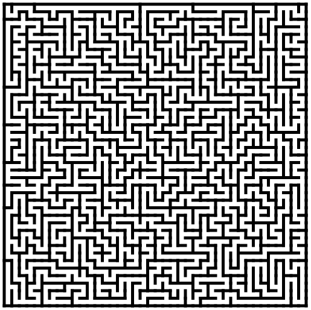

The script `df_maze.py` creates a maze using the depth-first algorithm as described at https://scipython.com/blog/making-a-maze/
Change the dimensions by altering the variables `nx` and `ny`.

For example with `nx = ny = 40`:

