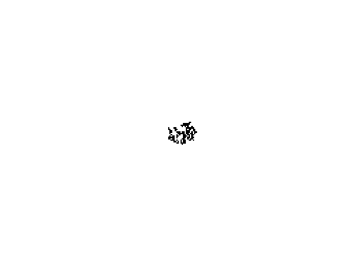

The script `df_maze.py` creates a maze using the depth-first algorithm as described at https://scipython.com/blog/making-a-maze/.
Change the dimensions by altering the variables `nx` and `ny`.

For example with `nx = ny = 40`:

`ca_maze.py` creates the frames for an animation of the growth of a maze using the cellular automaton algorithm described at https://scipython.com/blog/maze-generation-by-cellular-automaton/. The frames are written to the subdirectory `ca_frames/` and the maze size is again set by the variables `nx` and `ny`. The frames can be put together into an animated gif with [Imagemagick](https://www.imagemagick.org/script/index.php)'s `convert` utility. For example:

